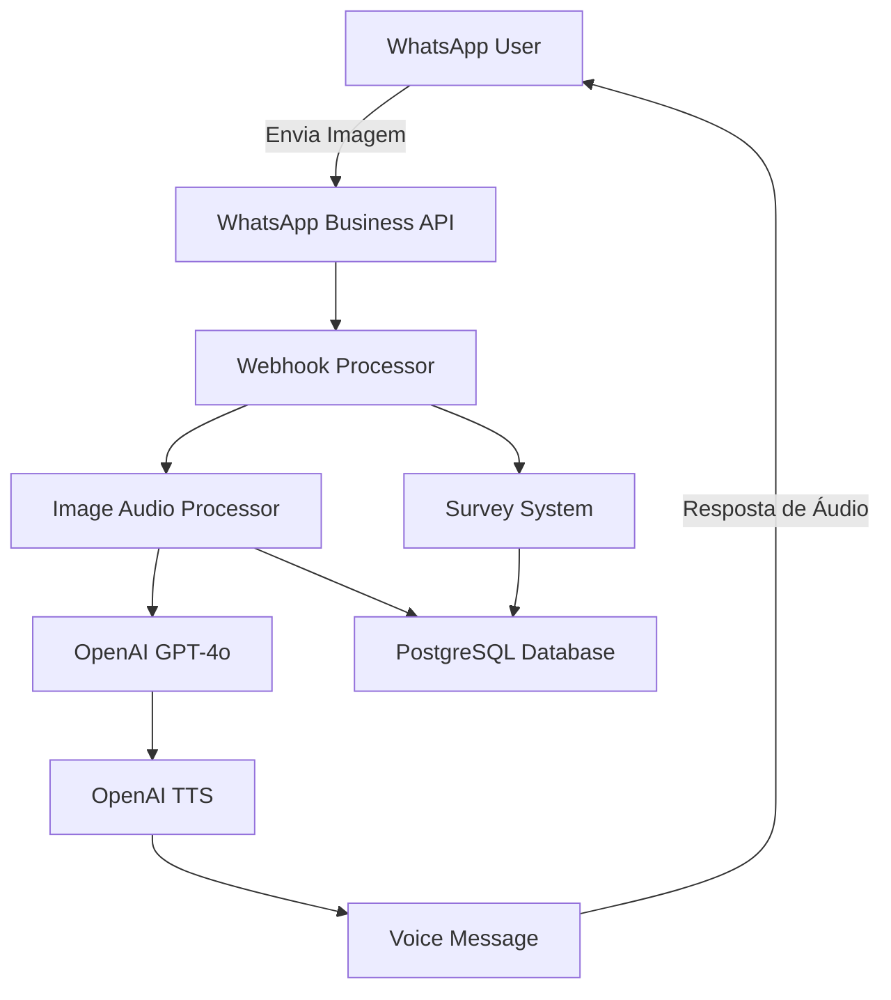

# 🎯 TCC - Sistema de Transcrição de Imagens

[](https://openjdk.java.net/)
[](https://spring.io/projects/spring-boot)
[](https://camel.apache.org/)
[](https://www.postgresql.org/)
[](https://openai.com/)
[](https://developers.facebook.com/docs/whatsapp)
[](https://www.docker.com/)

## 📖 Sobre o Projeto

Sistema inteligente de transcrição e descrição de imagens via WhatsApp, desenvolvido como Trabalho de Conclusão de Curso (TCC). O sistema utiliza inteligência artificial para analisar imagens enviadas pelos usuários e retorna descrições detalhadas em formato de áudio.

### 🚀 Funcionalidades Principais

- 📸 **Recepção de Imagens**: Recebe imagens via WhatsApp Business API
- 🤖 **Análise Inteligente**: Utiliza GPT-4o para descrever imagens detalhadamente
- 🎵 **Síntese de Voz**: Converte descrições em áudio usando OpenAI TTS
- 📊 **Pesquisa de Satisfação**: Sistema automatizado de feedback
- 📈 **Métricas de Performance**: Monitoramento completo do sistema
- ⚡ **Processamento Assíncrono**: Arquitetura não-bloqueante com Apache Camel

## 🏗️ Arquitetura



### 🔧 Tecnologias Utilizadas

| Categoria | Tecnologia | Versão | Propósito |
|-----------|------------|--------|-----------|
| **Backend** | Java | 21+    | Linguagem principal |
| **Framework** | Spring Boot | 3.0+   | Framework web |
| **Integração** | Apache Camel | 4.0+   | Enterprise Integration Patterns |
| **IA** | OpenAI GPT-4o | Latest | Análise de imagens |
| **TTS** | OpenAI TTS | Latest | Síntese de voz |
| **Banco** | PostgreSQL | 15+    | Persistência de dados |
| **Mensageria** | WhatsApp Business API | v19.0  | Interface de comunicação |
| **Container** | Docker | Latest | Containerização |

## 🚀 Quick Start

### Pré-requisitos

- Java 21+
- Docker e Docker Compose
- Conta WhatsApp Business API
- API Key OpenAI

### Instalação Rápida

```bash
# 1. Clone o repositório
git clone https://github.com/Pedrojhms/tcc-transcricao-image.git
cd tcc-transcricao-image

# 2. Configure as variáveis de ambiente
cp .env.example .env
# Edite o arquivo .env com suas credenciais

# 3. Inicie os serviços
docker-compose up -d

# 4. Execute a aplicação
./mvnw spring-boot:run
```

### 📱 Como Usar

1. **Envie uma imagem** para o número WhatsApp configurado
2. **Aguarde o processamento** (confirmação automática)
3. **Receba a descrição** em formato de áudio
4. **Responda à pesquisa** de satisfação (opcional)

## 📋 Exemplo de Uso

```json
{
  "input": "Imagem de um pôr do sol na praia",
  "output": {
    "description": "A imagem mostra um belo pôr do sol...",
    "audio_url": "https://api.whatsapp.com/audio/123",
    "processing_time": "2.3s"
  }
}
```

## 📚 Documentação

- 📐 [**Arquitetura**](docs/ARCHITECTURE.md) - Detalhes técnicos da arquitetura
- 🛠️ [**Configuração**](docs/SETUP.md) - Guia completo de instalação
- 📡 [**API**](docs/API_DOCUMENTATION.md) - Documentação das APIs
- 👨‍💻 [**Desenvolvimento**](docs/DEVELOPMENT.md) - Guia para desenvolvedores

## 📊 Status do Projeto

- ✅ Integração WhatsApp Business API
- ✅ Processamento de imagens com IA
- ✅ Síntese de voz (TTS)
- ✅ Sistema de pesquisa
- ✅ Arquitetura Processor Chains
- ✅ Métricas e monitoramento
- 🔄 Testes automatizados (em desenvolvimento)
- 🔄 Deploy em produção (planejado)

## 👥 Contribuindo

1. Fork o projeto
2. Crie sua feature branch (`git checkout -b feature/AmazingFeature`)
3. Commit suas mudanças (`git commit -m 'Add some AmazingFeature'`)
4. Push para a branch (`git push origin feature/AmazingFeature`)
5. Abra um Pull Request

## 📄 Licença

Este projeto é licenciado sob a Licença MIT - veja o arquivo [LICENSE](LICENSE) para detalhes.

## 👨‍🎓 Autor

**Pedro Henrique** - [Pedrojhms](https://github.com/Pedrojhms)

---

**📚 Trabalho de Conclusão de Curso (TCC)**  
*Sistema Inteligente de Transcrição de Imagens via WhatsApp*

### Configuração das variáveis de ambiente (Linux)

Inclua as linhas abaixo no final do seu arquivo `~/.bashrc` para que as variáveis de ambiente estejam sempre disponíveis:

```bash
nano ~/.bashrc

export DB_USERNAME="tccuser"
export DB_PASSWORD="senha_forte"
export DB_URL="jdbc:postgresql://db:5432/tcc_db"
export OPENAI_API_KEY="sua_api_key_aqui"

source ~/.bashrc

docker-compose down
docker-compose up -d
docker exec -it nome_do_container bash

echo $DB_USERNAME
echo $DB_PASSWORD
echo $DB_URL
echo $OPENAI_API_KEY
```

## Licença

Projeto acadêmico - sem licença definida.
