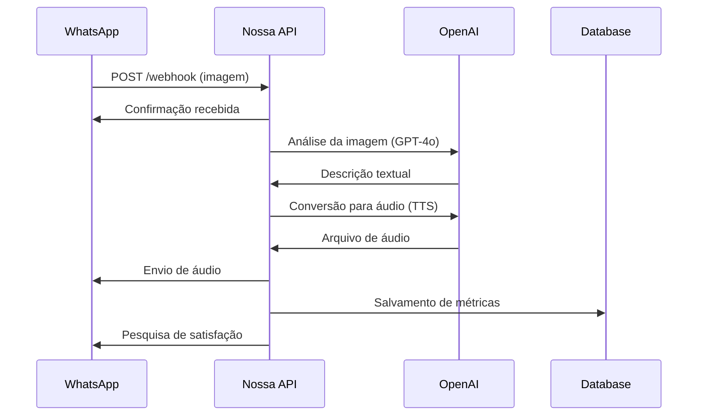

# 📡 Documentação da API

## 🔗 Endpoints Principais

### 🎯 WhatsApp Webhook

#### `POST /webhook`

Endpoint principal para recebimento de webhooks do WhatsApp Business API.

**Headers:**
```http
Content-Type: application/json
X-Hub-Signature-256: sha256=signature
```

**Request Body:**
```json
{
  "object": "whatsapp_business_account",
  "entry": [
    {
      "id": "WHATSAPP_BUSINESS_ACCOUNT_ID",
      "changes": [
        {
          "value": {
            "messaging_product": "whatsapp",
            "metadata": {
              "display_phone_number": "15550559999",
              "phone_number_id": "PHONE_NUMBER_ID"
            },
            "messages": [
              {
                "from": "5511999999999",
                "id": "wamid.ABC123",
                "timestamp": "1699564800",
                "type": "image",
                "image": {
                  "caption": "Descreva esta imagem",
                  "mime_type": "image/jpeg",
                  "sha256": "sha256hash",
                  "id": "IMAGE_ID"
                }
              }
            ]
          },
          "field": "messages"
        }
      ]
    }
  ]
}
```

**Response:**
```http
HTTP/1.1 200 OK
Content-Type: text/plain

OK
```

#### `GET /webhook`

Verificação do webhook (WhatsApp requirement).

**Query Parameters:**
- `hub.mode` - Deve ser "subscribe"
- `hub.verify_token` - Token de verificação configurado
- `hub.challenge` - Challenge a ser retornado

**Response:**
```http
HTTP/1.1 200 OK
Content-Type: text/plain

CHALLENGE_VALUE
```

## 📱 Fluxos de Integração

### 🖼️ Processamento de Imagem



### 📊 Sistema de Pesquisa

```json
{
  "messaging_product": "whatsapp",
  "to": "5511999999999",
  "type": "text",
  "text": {
    "body": "Como você avalia nosso serviço? 🌟\n\n1️⃣ Muito Ruim\n2️⃣ Ruim\n3️⃣ Regular\n4️⃣ Bom\n5️⃣ Excelente\n\nResponda com o número correspondente."
  }
}
```

## 🔧 Configurações da API

### 🌐 WhatsApp Business API

**Base URL:** `https://graph.facebook.com/v19.0/`

**Endpoints Utilizados:**
- `GET /{media-id}` - Download de mídia
- `POST /{phone-number-id}/messages` - Envio de mensagens

### 🤖 OpenAI API

**Modelos Utilizados:**
- **GPT-4o**: Análise e descrição de imagens
- **TTS-1**: Síntese de voz

**Configurações:**
```json
{
  "model": "gpt-4o",
  "messages": [
    {
      "role": "user",
      "content": [
        {
          "type": "text",
          "text": "Descreva esta imagem em detalhes para uma pessoa com deficiência visual."
        },
        {
          "type": "image_url",
          "image_url": {
            "url": "data:image/jpeg;base64,..."
          }
        }
      ]
    }
  ],
  "max_tokens": 500
}
```

## 📋 Estruturas de Dados

### 💬 Mensagem de Entrada

```typescript
interface WhatsAppMessage {
  from: string;           // Número do usuário
  id: string;            // ID único da mensagem
  timestamp: string;     // Unix timestamp
  type: "image" | "text" | "audio";
  image?: {
    caption?: string;
    mime_type: string;
    sha256: string;
    id: string;
  };
  text?: {
    body: string;
  };
}
```

### 📤 Mensagem de Saída

```typescript
interface WhatsAppOutgoingMessage {
  messaging_product: "whatsapp";
  to: string;
  type: "text" | "audio";
  text?: {
    body: string;
  };
  audio?: {
    id: string;  // Media ID do áudio
  };
}
```

### 📊 Métricas de Performance

```typescript
interface PerformanceMetrics {
  id: string;
  phoneNumber: string;
  processingStartTime: Date;
  processingEndTime: Date;
  processingTimeMs: number;
  imageAnalysisTimeMs: number;
  ttsGenerationTimeMs: number;
  totalResponseTimeMs: number;
  status: "SUCCESS" | "ERROR";
  errorMessage?: string;
}
```

## ⚠️ Códigos de Erro

### 🚨 Erros da Aplicação

| Código | Descrição | Ação |
|--------|-----------|------|
| `IMG_001` | Falha ao baixar imagem | Verificar conectividade |
| `AI_001` | Erro na análise de imagem | Tentar novamente |
| `TTS_001` | Falha na síntese de voz | Verificar cota OpenAI |
| `WA_001` | Erro ao enviar mensagem | Verificar token WhatsApp |
| `DB_001` | Erro de banco de dados | Verificar conectividade |

### 📱 Erros do WhatsApp

```json
{
  "error": {
    "message": "Invalid parameter",
    "type": "OAuthException",
    "code": 100,
    "error_subcode": 2018108,
    "fbtrace_id": "ABC123"
  }
}
```

## 🔒 Segurança

### 🛡️ Verificação de Webhook

```java
@Component
public class WebhookSecurity {
    
    public boolean verifySignature(String signature, String payload) {
        String expectedSignature = calculateSignature(payload);
        return MessageDigest.isEqual(
            signature.getBytes(), 
            expectedSignature.getBytes()
        );
    }
}
```

### 🔑 Autenticação

**WhatsApp Business API:**
```http
Authorization: Bearer {ACCESS_TOKEN}
```

**OpenAI API:**
```http
Authorization: Bearer {OPENAI_API_KEY}
```

## 📈 Rate Limits

### ⏱️ Limites por Serviço

| Serviço | Limite | Janela | Ação |
|---------|--------|--------|------|
| WhatsApp Business | 1000 msg/dia | 24h | Queue de mensagens |
| OpenAI GPT-4o | 500 req/min | 1min | Rate limiting |
| OpenAI TTS | 3 req/min | 1min | Throttling |

### 🔄 Estratégias de Retry

```java
@Retryable(
    value = {ApiException.class}, 
    maxAttempts = 3,
    backoff = @Backoff(delay = 1000, multiplier = 2)
)
public String processImage(String imageUrl) {
    // Lógica de processamento
}
```

## 🧪 Testando a API

### 📋 Webhook de Teste

```bash
curl -X POST http://localhost:8080/webhook \
  -H "Content-Type: application/json" \
  -H "X-Hub-Signature-256: sha256=test" \
  -d '{
    "object": "whatsapp_business_account",
    "entry": [
      {
        "id": "test",
        "changes": [
          {
            "value": {
              "messages": [
                {
                  "from": "5511999999999",
                  "id": "test_msg",
                  "timestamp": "1699564800",
                  "type": "image",
                  "image": {
                    "id": "test_image_id"
                  }
                }
              ]
            }
          }
        ]
      }
    ]
  }'
```

### 📊 Verificação de Status

```bash
# Health Check
curl http://localhost:8080/actuator/health

# Métricas
curl http://localhost:8080/actuator/metrics
```