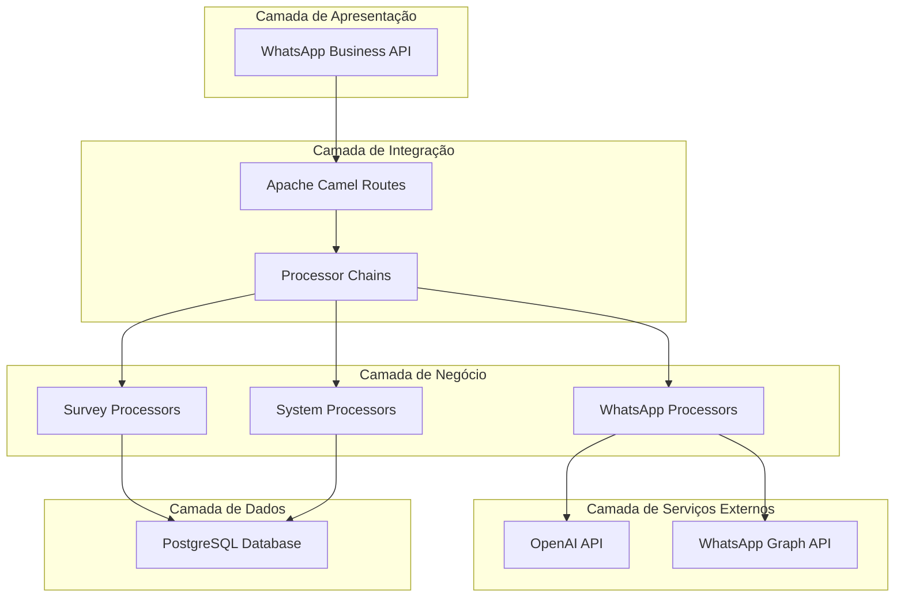
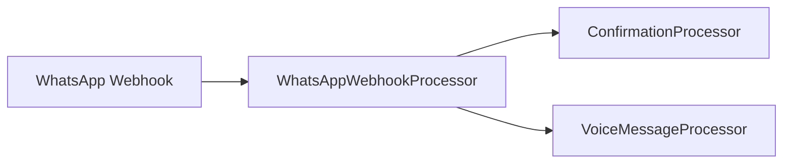
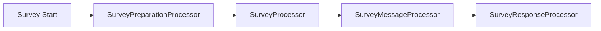
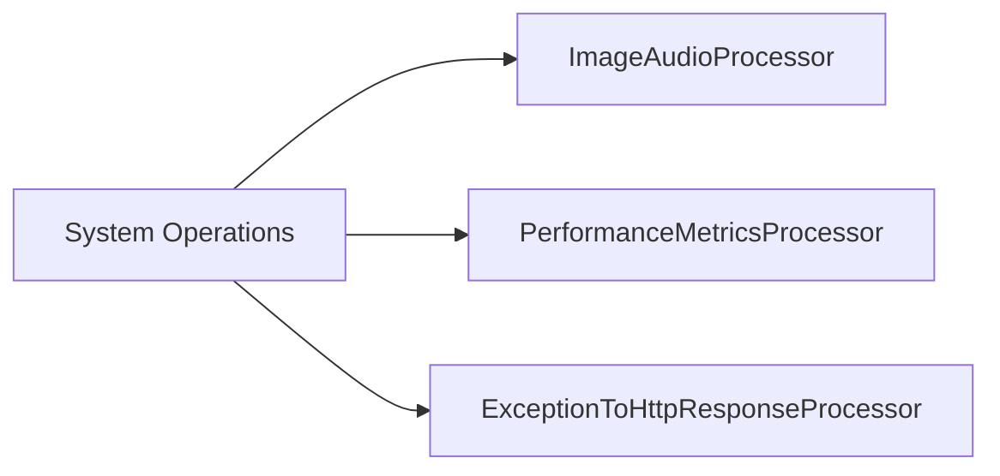
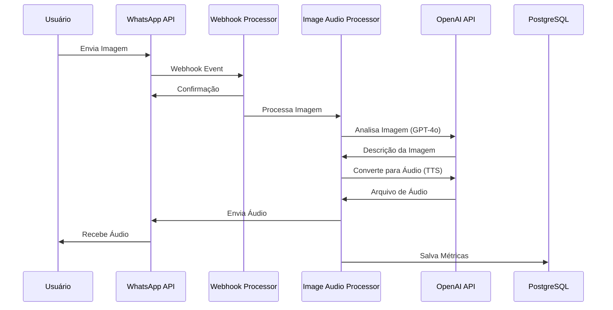
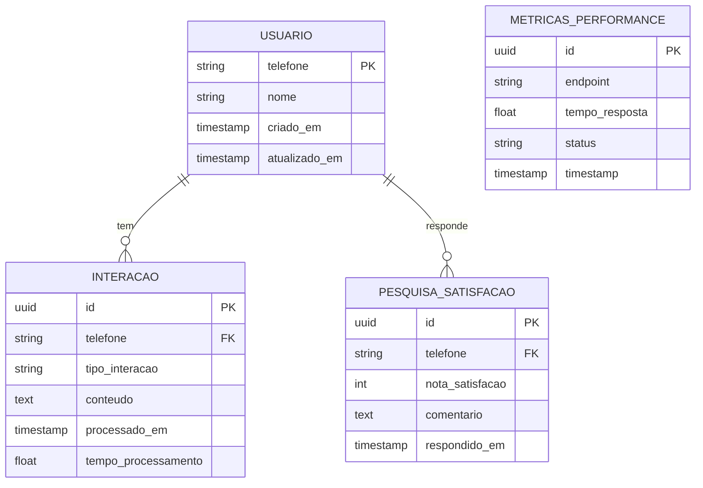

# 🏗️ Arquitetura do Sistema

## 📐 Visão Geral

O sistema de transcrição de imagens é construído usando uma arquitetura baseada em **Enterprise Integration Patterns** com Apache Camel, implementando o padrão **Processor Chains** para melhor organização e manutenibilidade.

## 🎯 Arquitetura de Alto Nível



## 🔗 Processor Chains

### 📱 WhatsAppProcessorChain

Responsável por todas as operações relacionadas ao WhatsApp:



**Componentes:**
- `WhatsAppWebhookProcessor`: Processa webhooks recebidos
- `ConfirmationProcessor`: Envia confirmações de recebimento
- `VoiceMessageProcessor`: Processa e envia mensagens de voz

### 📊 SurveyProcessorChain

Gerencia o sistema de pesquisa de satisfação:



**Componentes:**
- `SurveyPreparationProcessor`: Prepara dados da pesquisa
- `SurveyProcessor`: Lógica principal da pesquisa
- `SurveyMessageProcessor`: Formata mensagens da pesquisa
- `SurveyResponseProcessor`: Processa respostas dos usuários

### ⚙️ SystemProcessorChain

Operações de sistema e infraestrutura:



**Componentes:**
- `ImageAudioProcessor`: Processa imagens e gera áudio
- `PerformanceMetricsProcessor`: Coleta métricas de performance
- `ExceptionToHttpResponseProcessor`: Trata exceções e respostas HTTP

## 🔄 Fluxo de Dados Principal



## 🏛️ Padrões Arquiteturais

### 📋 Registry Pattern

```java
@Component
public class ProcessorRegistry {
    private final WhatsAppProcessorChain whatsAppChain;
    private final SurveyProcessorChain surveyChain;
    private final SystemProcessorChain systemChain;
    
    // Acesso centralizado a todas as chains
}
```

### 🔗 Chain of Responsibility

Cada chain agrupa processors relacionados, facilitando:
- **Manutenibilidade**: Alterações isoladas por domínio
- **Testabilidade**: Testes unitários focados
- **Extensibilidade**: Fácil adição de novos processors

### ⚡ Enterprise Integration Patterns

**Implementados com Apache Camel:**
- **Message Router**: Direcionamento de mensagens
- **Content Enricher**: Enriquecimento de dados
- **Wire Tap**: Processamento paralelo
- **Dead Letter Channel**: Tratamento de erros

## 📊 Modelo de Dados



## 🔧 Configuração de Ambiente

### Variáveis Críticas

```properties
# OpenAI Configuration
openai.api.key=${OPENAI_API_KEY}
openai.model.vision=gpt-4o
openai.model.tts=tts-1

# WhatsApp Business API
whatsapp.api.token=${WHATSAPP_TOKEN}
whatsapp.phone.number.id=${WHATSAPP_PHONE_ID}
whatsapp.webhook.verify.token=${WEBHOOK_VERIFY_TOKEN}

# Database
spring.datasource.url=${DATABASE_URL}
spring.datasource.username=${DB_USERNAME}
spring.datasource.password=${DB_PASSWORD}
```

## 📈 Métricas e Monitoramento

### KPIs Principais

- **Tempo de Resposta**: Média de processamento por imagem
- **Taxa de Sucesso**: Percentual de processamentos bem-sucedidos
- **Satisfação do Usuário**: Média das notas da pesquisa
- **Volume de Processamento**: Número de imagens processadas por período

### Logging Structure

```json
{
  "timestamp": "2024-01-10T12:00:00Z",
  "level": "INFO",
  "service": "image-transcription",
  "processor": "ImageAudioProcessor",
  "phone": "+5511999999999",
  "processing_time": 2.3,
  "status": "SUCCESS"
}
```

## 🚀 Escalabilidade

### Estratégias Implementadas

1. **Processamento Assíncrono**: Apache Camel routes não-bloqueantes
2. **Pool de Conexões**: Configuração otimizada do banco
3. **Cache de Resultados**: Cache em memória para operações frequentes
4. **Rate Limiting**: Controle de taxa para APIs externas

### Pontos de Melhoria

- **Containerização**: Docker para deployment
- **Load Balancing**: Múltiplas instâncias
- **Cache Distribuído**: Redis para cache compartilhado
- **Message Queue**: RabbitMQ para alta disponibilidade